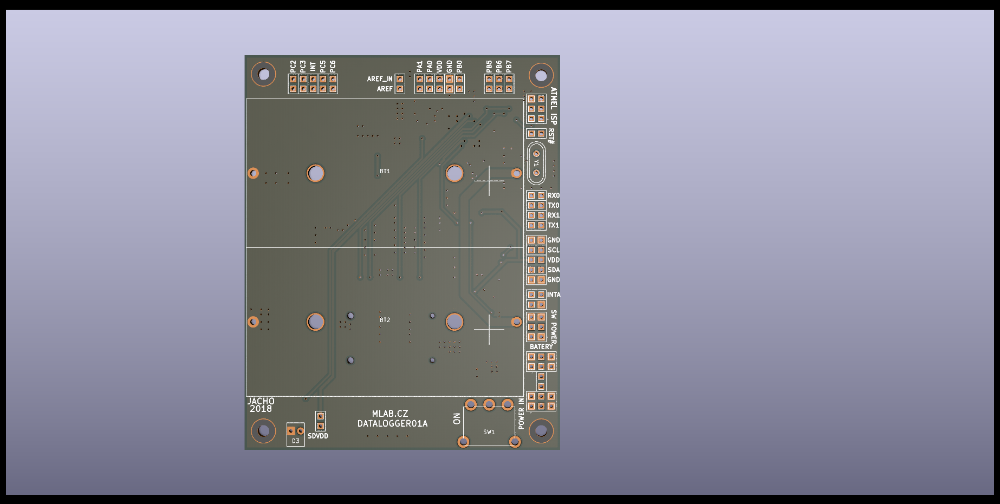

# DATALOGGER01 - MLAB's Versatile Electronic Module

The DATALOGGER01 is a versatile electronic module designed by MLAB, containing an ATmega1284p processor. The module is programmable in the Arduino IDE and compatible with a variety of development environments and programming languages.

 

One of the significant features of this module is an SD card slot, a convenient provision for data logging from the processor. With a built-in battery holder, the module ensures uninterrupted operation without reliance on an external power supply.

The DATALOGGER01 exhibits a range of applications, thanks to its I2C, UART, ADC input, and GPIO pins. Additionally, it's furnished with a power switch to effectively manage power consumption of connected devices.

Setting it apart, the module includes an EEPROM AT23CS64, containing a unique serial number to distinguish logs from different DATALOGGER01-based devices. Moreover, it comprises a PCF85263 RTC circuit, with the option to connect a backup battery.

## Key Features:
- **Processor:** [ATmega1284p](https://en.wikipedia.org/wiki/Atmel_AVR#ATmega)
- **Interoperability:** Compatibility with Arduino and supports a range of other development platforms and programming languages.
- **Data Logging:** An SD Card Slot for extensive data storage.
- **Power Management:** Self-sufficient with an integrated battery holder.
- **Connectivity Options:** Diverse interfacing options with I2C, UART, ADC input, and GPIO pins.
- **Energy Efficiency:** Onboard power switch for managing external devices' power consumption.
- **Unique Identification:** Inbuilt [EEPROM AT23CS64](https://www.mouser.com/datasheet/2/268/doc0180-1353557.pdf) with a unique serial number.
- **Real-Time Tracking:** Inclusion of a [PCF85263](https://www.nxp.com/docs/en/data-sheet/PCF85263A.pdf) RTC circuit with backup battery connectivity.

## Potential Use Cases:
- **Data Collection:** Can collect, store, and analyze data from various sensors and devices.
- **Remote Monitoring:** Can be incorporated into IoT systems for remote data collection and monitoring.
- **Autonomous Systems:** Suitable for devices needing independent functioning.
- **Space Research:** Applicable as data loggers and locator devices for stratospheric balloons.

## In Action:
- The DATALOGGER01 module has proven its efficacy in:
   - **[GEODOS01](https://www.ust.cz/UST-dosimeters/GEODOS/)**: A fully autonomous scintillation detector incorporating LoRa IoT, operating without human intervention.
   - **FÍK stratospherics balloons Avionics**: DATALOGGER1 played a important role as a data logger and locator in the stratospheric balloons' avionics organized by [ODZ ÚJF](http://www.ujf.cas.cz/cs/oddeleni/oddeleni-dozimetrie-zareni/vyzkum/lety-fik/).

## Schematics

## Useful Links:
- [ATmega1284p](https://en.wikipedia.org/wiki/Atmel_AVR#ATmega) - Wikipedia
- [ARDUINO Programming Environment](https://www.arduino.cc/) - Official Arduino Site
- [EEPROM AT23CS64](https://www.mouser.com/datasheet/2/268/doc0180-1353557.pdf) - Mouser Electronics
- [PCF85263](https://www.nxp.com/docs/en/data-sheet/PCF85263A.pdf) - NXP Semiconductors

Discover the potential of DATALOGGER01 module and utilize it for your projects!
